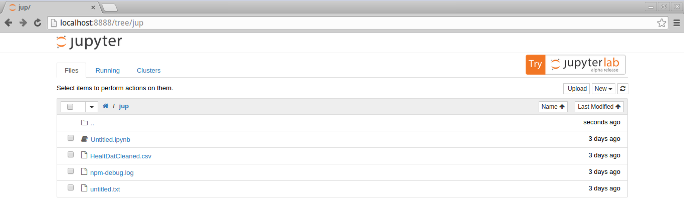
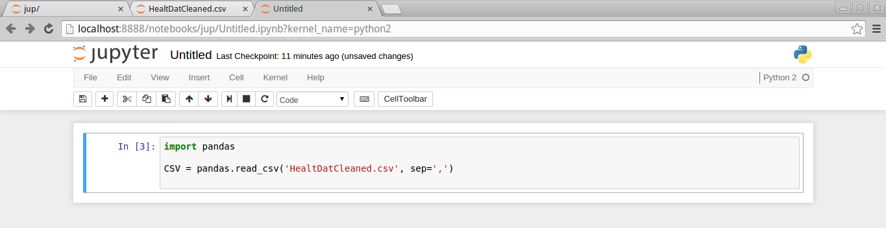
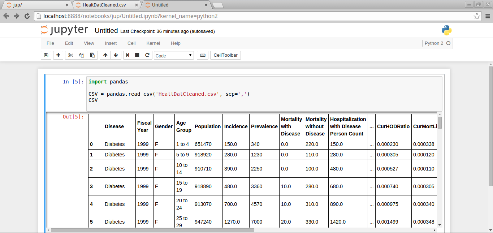

# Blog Post 2
------------

##Thus far...
-----------

After reducing the amount of course term projects for the semester
and reupdating this forked repo on the 395 branch, I will soo set about the 
application of my cmpt491 course project that is to be stylized in LaTex
onto the jupyter notebook, or at least the presentation of data.
The contents will speak for itself with a set of screen caps that describe
the process of adding the nefarious details.

An awesome thing about jupyter is that it has so many dimensions for reporting
in general; the aspect of coding onto the report itself saves oodles of time
from the back and forth that a typical undergrad would go through in making
reports for labs, research or whatever data detailing necessary. Another is 
that it can be interactive for the viewers of a paper when published.

##Attempt: Making a table of csv data
-------------------

Over the course of this semester, I needed a data set in order to actually 
data-mine. Our group used the Canadian Center of Disease control to find some
trends in chronic health illness. For the sake of introducing the usability of
this notebook, we will attempt to plot the process of plotting the Health data's
csv file content.

First, you must make sure that you have pandas. What is it? Pandas is just the
tabular structure which must be imported so that the user can actually tabulate their 
data. Pretty straight forward. We need this line in order to aquire it on the CS50 VM:

```
sudo pip install pandas ipython[all] jupyter
```
Next, after launching the jupyter notebook, keep your .csv file in an accessible location 
that your project can access.

The example here shows that I am using the file HealtDatCleaned.csv as the guinea pig.



Now let's actually load in the .csv!

Unless there is already an ipython notebook already that you would like to add to,
add the line

```
import pandas
```

at the top of the notebook's first few lines (where you would typically put imports), this
should work since we have already installed the pandas library as mentioned previously. 

Next, we want to actually load our csv data, we can do this with this particular line here
inside the same cell that we have imported pandas into:

```
CSV = pandas.read_csv('HealtDatCleaned.csv', sep',')
```
And as illustrated here:



A thing to note here is that you must know what the seperator symbol is here for you your data
as CSVs can have different ones depending on what program you've saved the data to csv in, like
';', or ':' or even ','. In this example, the seperator is ','. 

And finally, on the next line:

```
CSV
```

Run the cell code and you should get a perfectly tabulated form of your data!



Note that there are also '...' since this table has 7488 rows of data with 26 columns of dimensions.
