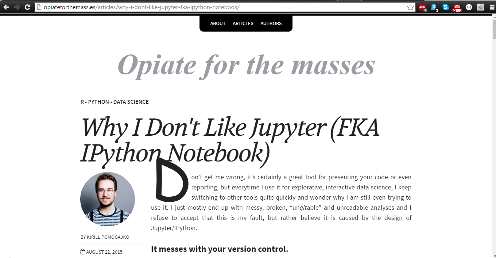

# Blog Post 2
------------

##Thus far...
-----------

After reducing the amount of course term projects for the semester
and reupdating this forked repo on the 395 branch, I will soo set about the 
application of my cmpt491 course project that is to be stylized in LaTex
onto the jupyter notebook, or at least the presentation of data.
The contents will speak for itself with a set of screen caps that describe
the process of adding the nefarious details.

An awesome thing about jupyter is that it has so many dimensions for reporting
in general; the aspect of coding onto the report itself saves oodles of time
from the back and forth that a typical undergrad would go through in making
reports for labs, research or whatever data detailing necessary. Another is 
that it can be interactive for the viewers of a paper when published.

##Attempt: Making a table of csv data / ARTIFACT# 1
-------------------

Over the course of this semester, I needed a data set in order to actually 
data-mine. Our group used the Canadian Center of Disease control to find some
trends in chronic health illness. For the sake of introducing the usability of
this notebook, we will attempt to plot the process of plotting the Health data's
csv file content.

First, you must make sure that you have pandas. What is it? Pandas is just the
tabular structure which must be imported so that the user can actually tabulate their 
data. Pretty straight forward. We need this line in order to aquire it on the CS50 VM:

```
sudo pip install pandas ipython[all] jupyter
```
Next, after launching the jupyter notebook, keep your .csv file in an accessible location 
that your project can access.

The example here shows that I am using the file HealtDatCleaned.csv as the guinea pig.


Now let's actually load in the .csv!

Unless there is already an ipython notebook already that you would like to add to,
add the line

```
import pandas
```

at the top of the notebook's first few lines (where you would typically put imports), this
should work since we have already installed the pandas library as mentioned previously. 

Next, we want to actually load our csv data, we can do this with this particular line here
inside the same cell that we have imported pandas into:

```
CSV = pandas.read_csv('HealtDatCleaned.csv', sep',')
```
And as illustrated here:


A thing to note here is that you must know what the seperator symbol is here for you your data
as CSVs can have different ones depending on what program you've saved the data to csv in, like
';', or ':' or even ','. In this example, the seperator is ','. 

And finally, on the next line:

```
CSV
```

Run the cell code and you should get a perfectly tabulated form of your data!


Note that there are also '...' since this table has 7488 rows of data with 26 columns of dimensions.

NOTE: This is just a snippet of what one can do in the jupyter environment, all in all this was primarily
a demonstration of what can be achieved with simple python, but ultimatly, the visual aspect is what I am
trying to promote.

NOTE: You can also add markdown to the notebook as well, simply create a new cell block via the + icon; this
will insert a new cell block below but it can be easily moved with the arrow buttons at the top menu or edit tab.
After, goto Cell->Cell Type->markdown and Type in your markdown blurbs and run the cell exactly as if it were 
like the python code example and <BAM!> your markdown formatting will be displayed.

## Artifact #2:
--------------

During my research of learning the whiles of Jupyter, I came across a review for it at [this link](http://opiateforthemass.es/articles/why-i-dont-like-jupyter-fka-ipython-notebook/), which was published on
August 22,2015.



A quick breakdown of the points of emphasis for the article and particularsL

+   Messes with version control - by this he also mention about multiple formats with the code needing to be recompiled each time it is even slightly modified (and there could be quite a bit of code blocks so each one of those needs to be executed).
+   Code can only be run in chunks - each cell segment is executed line by line per cell
+   Traceability (or it is hard to keep track of) - emphasis on modifications of code (another version control issue)
+   Code is very fragmented - because you do not have to compile each cell in order from top to bottom, which can cause issues when you are referring to In[57] when you happen to call it on In[23]
+   The output is very incomplete - R specific scripting
+   Potential security risks
+   Limitations on making shiny applications

Essentially, Kirill had a hard time with using R in jupyter for the most part with some presentation of the notebook. Most of the points raised were quite valid in my opinion; there was a particular point about the code being fragmented is quite a legitimate concern. While I was tinkering away with the python code, it was apparent that each cell had to be executed seperately and reference to variable in other cells was indeed in an unordered fashion for some strange reason. Another thing that I should mention, is that I had never used R, so I could not really relate to the output being incomplete, but the other points I did not have enough reference to have a solid opinion of - version control for instance because none of my attempted applications where not too big. The potential security risk was something that was also more beyond my scope; I had only run jupyter on the localhost setting so there was not really any concern (unless my machine was comprimised already). Traceability is somewhat taken care of with jupyter because the log, when executing the jupyter notebook in the terminal, does keep track of cell activity to some extent but Kirill must be looking into something much more specific with actual string modifications.

Now there was a suprise in the comments for this article:


An actual Jupyter core developer commented! Within the jupyter/notbook repo, he goes by the handle of ellisonbg and is seen quite often commenting on issues and PR (core dev status indeed). The first point on version control was in agreement to which he referred to an ipython extension. Code chunks was deemed an issue of general workflow for the author of the notebook (so not much could be done in gneral for that). The incomplete output with R could have been a bug so there was a link to the Ikernel. The security concern was refered to ipython/jupyter documentation for actual configuration and a github repo to report on possible issues. Finally, making the notebook "shiny" was pointed to be an ongoing issue being addressed with other users trying to make Jupyter look good.

Brian (core dev) welcomed the idea of the feedback and the general takeaway that I got from reviewing this article was that critical feedback is always essential when dealing with projects, not matter what the scale. Although some points may appear trivial from the initial standpoint, it can indeed become a larger issue later on. The whole process is somewhat akin to how testing is but less in a coding sense. It also reflect on what the EPL project for CMPT395 was like with feedback since is always room for improvement and keeping an open mindset about that is a good thing to have.
